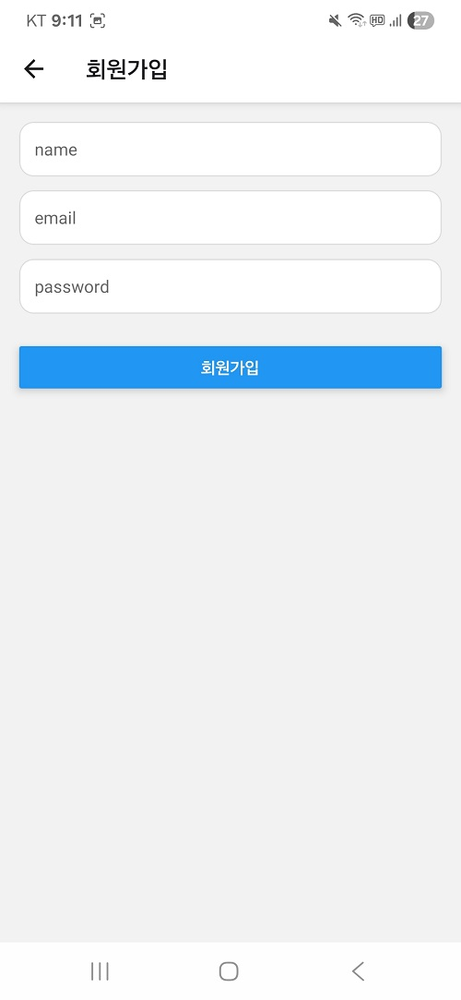
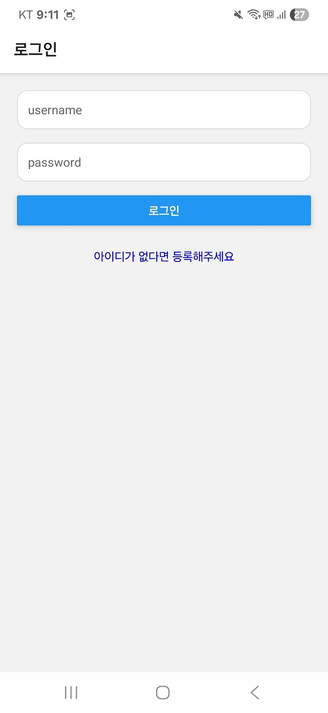
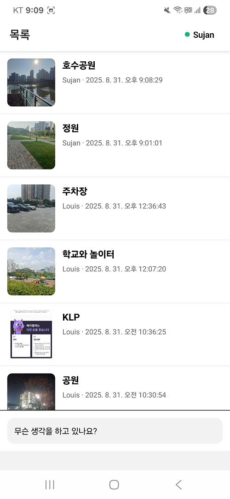
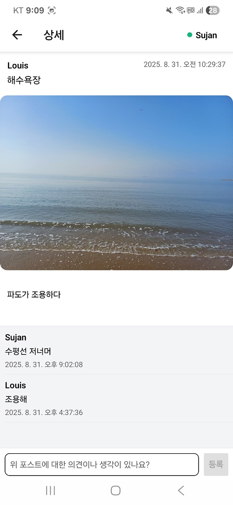
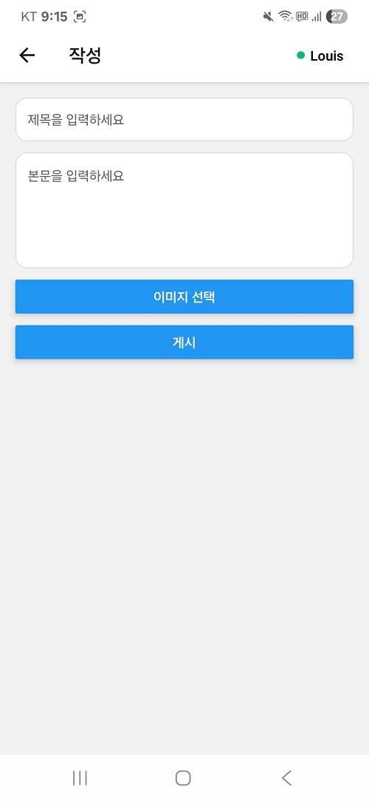
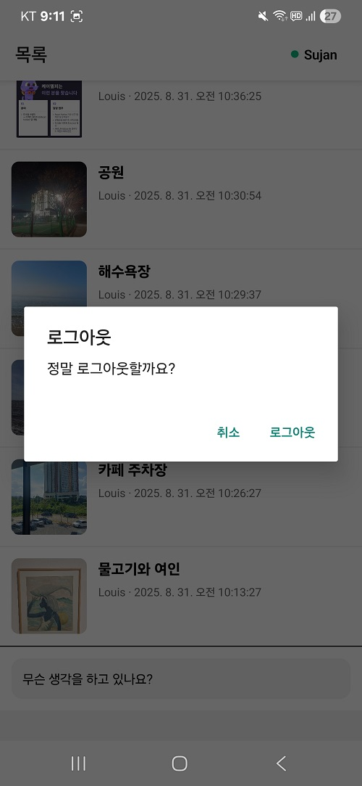

### 0. 프로젝트 개발자
#### 개발자 : 조홍래 - 앱 외주 개발 / 어플 출시
#### 깃허브 : https://github.com/louis2487
#### 이메일 : 36y4ws7@naver.com  

  
### 1. 프로젝트 개요
#### 프로젝트 : 분양대행 구인공고 어플
#### 타켓 사용자 : 분양상담사, 외부 대행사
#### 클라이언트 : 대원파트너스
#### 착수일 : 25/08/28
#### 기간 : 3개월 ~ 6개월

### 2. 사용 기술

#### UI + Activity : React Native Expo 
#### Client : Axio fetch 
#### Server : Fast API
#### DB : PostgreSQL
#### Hosting : Reilway
#### File Storage : Reilway Volume  

  

### 3. 필수 화면 (핵심 기능)
#### 3-1 . 회원가입/로그인 화면
##### 이름, 닉네임, 전화번호, 거주지  

### 3-2. 메인 홈 화면
##### 최신 구인 공고 리스트
##### 지역 조건 필터  

#### 3. 구인 공고 상세 화면
##### 분양 현장 정보 (위치, 조건, 수수료, 근무기간)
##### 사진/지도 첨부  

#### 4. 공고 등록 
###### 필드: 제목, 현장 위치(주소/좌표), 기간, 근무시간, 급여(일급/수수료/정산주기), 인원수, 담당자명/전화번호, ###### 상세설명, 태그
###### 상태: 게시/마감  

#### 5. 마이페이지 내 공고 관리 – 수정/삭제/마감
##### 내가 올린 공고 리스트(게시/마감 선택, 수정/삭제 지원), 로그아웃 기능   

### 4. 유저 흐름

### 4.1 회원가입
  

### 4.2 로그인
  

### 4.3 목록
  

### 4.4 상세
  

### 4.5 작성
  

### 4.6 로그아웃
  
  

### 5. API 요약

### **5.1 인증**
#### POST /community/signup : 회원가입
#### POST /community/login : 로그인  

### **5.2 게시글**
#### GET /community/posts: 목록
#### GET/community/posts/${id} 상세
#### POST /community/posts : 작성  

### **5.3 댓글**
#### POST /community/posts/${postId}/comments : 댓글 작성  
#### GET /community/posts/${postId}/comments : 댓글 읽기  

### 6. GitHub Source Code

#### React Native App : https://github.com/louis2487/daewonapp/tree/master/app
#### Backend : https://github.com/louis2487/myapi/blob/master/main.py  
  

### 7. 시연 영상 - 프리퀄

#### (https://www.youtube.com/shorts/7X0e7kNGXls)